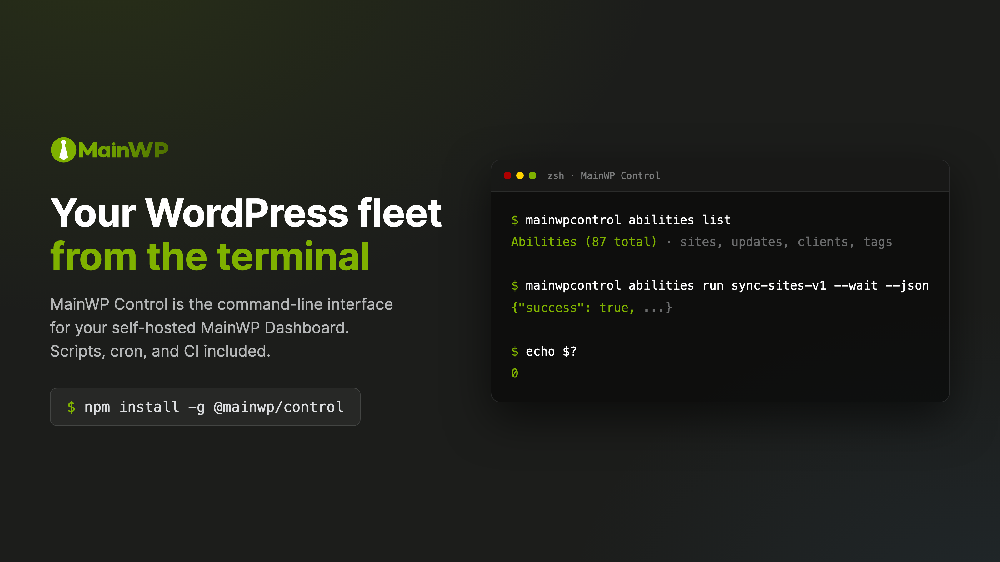

<p align="center">
  
</p>

<p align="center">
  
  <a href="https://www.npmjs.com/package/@mainwp/control"></a>
  <a href="https://github.com/mainwp/mainwp-control/actions/workflows/ci.yml"></a>
</p>

# MainWP Control

_A [MainWP Labs](https://mainwp.com/mainwp-labs/) project, powered by MainWP_

Manage your whole WordPress network from the terminal. [MainWP Control](https://github.com/mainwp/mainwp-control) is a command-line interface for your MainWP Dashboard, built for the work you do on a schedule rather than in a browser tab:

```bash
# Which sites have pending updates?
mainwpcontrol abilities run list-updates-v1 --json

# Sync every site and wait for the result
mainwpcontrol abilities run sync-sites-v1 --wait --json

# Nightly health check from cron, alert on failure
mainwpcontrol abilities run check-sites-v1 --quiet \
  || curl -fsS "$SLACK_WEBHOOK" -d '{"text":"Sites down"}'
```

The CLI is a small program that runs on your own computer or server. Nothing new is installed on your Dashboard or your child sites; it talks to the same Abilities API your Dashboard already exposes. Anything classified as destructive stops for a preview and your explicit confirmation before it runs.

<p align="center">
  
</p>

**Looking for the MCP Server instead?** [MainWP MCP Server](https://github.com/mainwp/mainwp-mcp) connects Claude, Cursor, and other AI tools to your Dashboard for conversational management. MainWP Control is for automation: cron jobs, CI/CD pipelines, monitoring scripts, and batch operations. Both talk to the same Abilities API with the same safety model.

## Why a CLI?

The Dashboard UI is built for a person clicking through sites. A CLI is built for everything that should happen without you watching:

- **Scriptable output.** `--json` prints exactly one machine-readable envelope on stdout. Warnings and progress never contaminate it, so you can pipe results straight into `jq`, a spreadsheet, or a monitoring agent.
- **Honest exit codes.** Classified outcomes exit 0-5 by error class (input, auth, network, API, internal); interruptions use the standard signal exits (130/143). Your pipeline branches on the code instead of parsing error text.
- **Batch operations that survive.** Large operations queue as batch jobs with a `job_id` you can watch, wait on, or come back to. A timeout or Ctrl-C leaves you with a resumable job, not a mystery.
- **Credentials that stay put.** Passwords live in your OS keychain, or in an environment variable for CI. The profile file on disk never contains them.
- **Guard rails you can't script around by accident.** Destructive abilities require a successful `--dry-run` preview and an explicit `--confirm`, and each confirmed run is written to a local audit log.

## What You Can Do

- **Site Management**: List sites, check connection status, sync data, add or remove child sites
- **Update Management**: See pending updates across all sites, apply core/plugin/theme updates
- **Plugin and Theme Control**: View installed plugins and themes, activate or deactivate them
- **Client Organization**: Manage client records, assign sites to clients, track costs
- **Bulk Operations**: Sync, reconnect, or check connectivity across dozens of sites at once
- **Chat Mode**: Optionally talk to your Dashboard in plain English, with the same safety gates

Built for WordPress agencies and site managers who want their MainWP routine in scripts, schedulers, and pipelines.

## Quick Start

**Requirements:** Node.js >=20.18.1 and MainWP Dashboard 6.0+

> **On Windows?** Use [Git Bash](https://gitforwindows.org/) and every example below works without changes. For scheduled workflows (cron), see [WSL](https://learn.microsoft.com/en-us/windows/wsl/install).

**1. Create an Application Password.** This is a separate password WordPress issues for tools like this one; it never changes your login and you can revoke it at any time.

1. Log into your MainWP Dashboard as an administrator
2. Go to **Users > Profile** (click your username in the top right)
3. Scroll to the **Application Passwords** section
4. Enter a name like "MainWP Control" and click **Add New Application Password**
5. Copy the generated password immediately (it is only shown once; spaces are fine either way)

> **Tip:** Create a dedicated WordPress user for API access rather than using your main admin account. It keeps the audit trail clean and is easy to revoke later.

**2. Install and log in.**

```bash
npm install -g @mainwp/control

mainwpcontrol login
```

`login` prompts for your Dashboard URL, username, and the Application Password, then stores the credentials in your OS keychain. For CI and headless machines, use [environment variable auth](docs/configuration.md#environment-variable-auth) instead.

**3. See what your Dashboard can do.**

```bash
mainwpcontrol abilities list
```

```text
Abilities (87 total)

  Sites
Name              Description           Type
----------------  --------------------  --------------
list-sites-v1     List MainWP sites     📖 read
    mainwpcontrol abilities run list-sites-v1
get-site-v1       Get site details      📖 read
    mainwpcontrol abilities run get-site-v1
sync-sites-v1     Sync all sites        ✏️  write
    mainwpcontrol abilities run sync-sites-v1
```

Every operation your Dashboard supports, with the exact command to run it and whether it reads, writes, or destroys. Pick one and run it:

```bash
mainwpcontrol abilities run list-sites-v1 --json
```

> **New to the command line?** [Getting Started](docs/getting-started.md) covers terminals, environment variables, JSON quoting, and everything else the other guides assume.

## Everyday Commands

```bash
# Check for pending updates across all sites
mainwpcontrol abilities run list-updates-v1 --json

# Get details for one site
mainwpcontrol abilities run get-site-v1 --input '{"site_id_or_domain": 1}' --json

# Preview a destructive action; nothing changes without --confirm
mainwpcontrol abilities run delete-site-v1 \
  --input '{"site_id_or_domain": "mysite.com"}' \
  --dry-run --json

# Updates are classified destructive too: preview, then confirm
# (--force skips the interactive prompt for CI; --wait blocks until done)
mainwpcontrol abilities run update-site-plugins-v1 \
  --input '{"site_id_or_domain": 1}' --dry-run --json
mainwpcontrol abilities run update-site-plugins-v1 \
  --input '{"site_id_or_domain": 1}' --confirm --force --wait --json

# See the input schema for any ability
mainwpcontrol abilities info update-site-plugins-v1

# Something wrong? Diagnose configuration and connectivity
mainwpcontrol doctor
```

Managing more than one Dashboard? Each `login` creates a profile named after the hostname; switch with `mainwpcontrol profile use <name>` or per-command with `--profile <name>`. See the [CLI Reference](docs/cli-reference.md#profile) for details.

> **Windows PowerShell** quoting of inline JSON is unreliable; put parameters in a file and use `--input-file` instead. Git Bash handles the examples as written. Details in [Input from File](docs/workflows/input-from-file.md).

## Documentation

- [Getting Started](docs/getting-started.md): terminals, npm, Application Passwords, and JSON quoting, if the command line is new territory
- [CLI Reference](docs/cli-reference.md): every command, flag, and exit code
- [Configuration](docs/configuration.md): profiles, settings.json, environment variables, and credential storage
- [Safety & Destructive Operations](docs/safety.md): the preview-and-confirm flow, ability annotations, batch jobs, and what the guard rails do and don't cover
- [Chat Mode](docs/chat.md): plain-English management with your own LLM API key
- [Troubleshooting](docs/troubleshooting.md): install failures, connection errors, and authentication issues

Step-by-step automation guides live in [docs/workflows](docs/workflows):

| Workflow | Description |
|----------|-------------|
| [Daily Health Check](docs/workflows/daily-health-check.md) | Cron job that checks site connectivity and alerts via Slack |
| [Plugin Deployment Verification](docs/workflows/plugin-deployment-verification.md) | GitHub Actions workflow to verify a plugin exists across all sites |
| [Monthly Batch Updates](docs/workflows/monthly-batch-updates.md) | Preview and apply updates safely, scripted and GitHub Actions variants |
| [Input from File](docs/workflows/input-from-file.md) | Pass complex parameters via JSON files, stdin pipes, or heredocs |
| [Monitoring Integration](docs/workflows/monitoring-integration.md) | Send site metrics to Datadog, StatsD, or other monitoring tools |

## Configuration

Interactive use needs no configuration beyond `mainwpcontrol login`. For CI, Docker, and headless machines:

| Variable | Description |
|----------|-------------|
| `MAINWP_APP_PASSWORD` | Application Password for non-interactive login, and for commands when no OS keychain is available |
| `MAINWPCONTROL_NO_KEYTAR` | Set to `1` to skip keychain loading entirely |
| `MAINWP_ALLOW_HTTP` | Set to `1` to allow insecure `http://` Dashboard URLs |

```bash
export MAINWP_APP_PASSWORD='xxxx xxxx xxxx xxxx xxxx xxxx'
mainwpcontrol login --url https://dashboard.example.com --username admin
```

Optional defaults (JSON output, timeouts, chat provider) live in `~/.config/mainwpcontrol/settings.json`. The full list of settings, chat provider keys, and the credential storage model are in the [Configuration guide](docs/configuration.md).

## Abilities

Your Dashboard exposes its operations as versioned, self-describing "abilities" (the exact set varies by Dashboard version):

| Category         | Abilities | Reference                                                                                 |
| ---------------- | --------- | ----------------------------------------------------------------------------------------- |
| Sites            | 30        | [Sites Abilities](https://docs.mainwp.com/api-reference/abilities-api/sites)              |
| Updates          | 13        | [Updates Abilities](https://docs.mainwp.com/api-reference/abilities-api/updates)          |
| Clients          | 11        | [Clients Abilities](https://docs.mainwp.com/api-reference/abilities-api/clients)          |
| Tags             | 7         | [Tags Abilities](https://docs.mainwp.com/api-reference/abilities-api/tags)                |
| Batch Operations | 1         | [Batch Operations](https://docs.mainwp.com/api-reference/abilities-api/batch-operations)  |

The table counts the Dashboard's built-in `mainwp/*` abilities. Extensions and other plugins can register their own, so your total may be higher (the 87 in the Quick Start sample comes from a Dashboard with extensions installed). `abilities list` shows what your Dashboard actually offers, `abilities info <name>` shows an ability's input schema and annotations, and `abilities run <name>` executes it. Because the CLI discovers abilities at runtime, new Dashboard capabilities appear without a CLI update.

## Safety

Every ability carries annotations that classify it as read-only, a write, or destructive, and the CLI enforces them. Destructive operations follow a two-step flow: a `--dry-run` preview shows what the Dashboard reports would be affected, and only an explicit `--confirm` executes it. The destructive class is deliberately wide: deletions, updates (`update-site-*`, `run-updates-*`, `update-all-*`), any ability that does not declare itself non-destructive, and a conservative name-based override that a mislabeling Dashboard cannot downgrade. The two flags are mutually exclusive, previews that fail block execution, and each confirmed run is written to a local audit log. Scripted pipelines that have already validated an operation can pass `--confirm --force` to skip the interactive prompt; that is a deliberate, per-command decision, never a default. Chat mode goes through the identical execution path, so an LLM can propose a destructive action but cannot confirm it. The full model is in [Safety & Destructive Operations](docs/safety.md).

## Contributing

```bash
npm ci             # install dependencies
npm run build      # build
npm test           # run tests (unit + e2e, no network needed)
npm run lint       # check code style
```

CI runs lint, type check, tests, and build on every pull request.

`npm run test:live` exercises a real Dashboard: API tests (login, discovery, read-only execution, safety model, exit codes) plus validation that every jq expression and field name in `docs/workflows/` works against the real API. It runs read-only operations and `--dry-run` previews only, never mutations, and needs credentials:

```bash
export MAINWP_API_URL=https://your-dashboard.example.com
export MAINWP_USER=your-admin-username
export MAINWP_APP_PASSWORD='your-application-password'

npm run test:live
```

The full acceptance harness, which packs and installs the CLI as a consumer would, is described in [Acceptance Testing](docs/acceptance-testing.md).

## License

GPL-3.0-or-later. See [LICENSE](LICENSE).

---

- [MainWP](https://mainwp.com/)
- [MainWP MCP Server](https://github.com/mainwp/mainwp-mcp)
- [Issue Tracker](https://github.com/mainwp/mainwp-control/issues)
