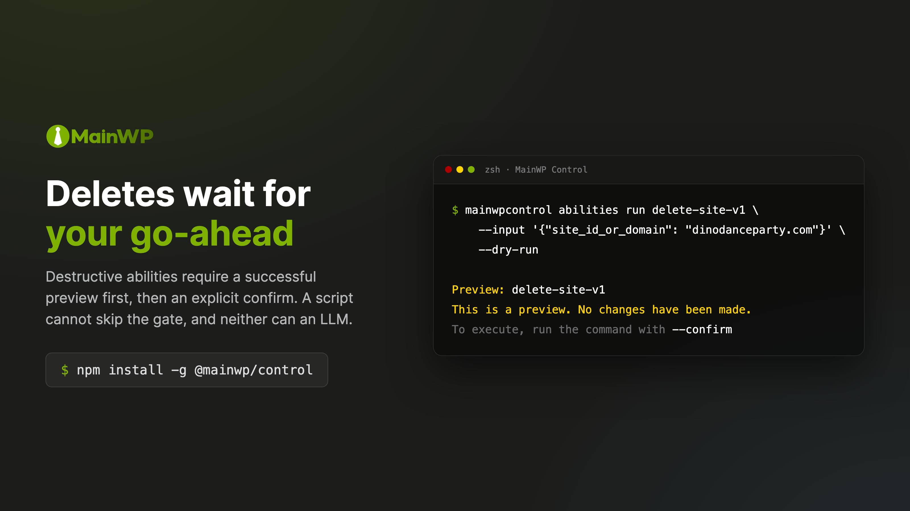

# Safety & Destructive Operations

MainWP Control assumes that a command capable of deleting a client site deserves more friction than one that lists plugins. This page describes the model: how abilities are classified, what the preview-and-confirm flow requires, how batch jobs behave, and where the guard rails end.

<p align="center">
  
</p>

## Ability annotations

Every ability your Dashboard exposes carries annotations, visible with `mainwpcontrol abilities info <name>`:

- **Readonly**: Safe to run anytime. Cannot modify data.
- **Destructive**: Permanently changes or deletes data. Requires a `--dry-run` preview, then `--confirm` to execute.
- **Idempotent**: Repeated calls have no additional effect under the same conditions. This describes the ability, and it is not permission to retry: a destructive confirm whose outcome is unknown is never re-run automatically, and you should verify Dashboard state before re-running it yourself (see below).

Classification fails closed, twice over. An ability that does not declare itself non-destructive is treated as destructive. On top of that, a conservative name-based override forces the destructive class for known-dangerous name patterns (`delete-*`, `disconnect-*`, `suspend-*`, `update-site-*`, `run-updates-*`, `update-all-*`, `wipe-*`, and similar), whatever the Dashboard's annotations say, so a buggy or compromised server cannot downgrade a delete into a quiet write. In practice this means updates require the confirm flow; non-destructive writes like syncing sites do not.

## The preview-and-confirm flow

```bash
# Step 1: Preview. Nothing changes.
mainwpcontrol abilities run delete-site-v1 \
  --input '{"site_id_or_domain": "mysite.com"}' \
  --dry-run --json

# Step 2: Execute, after reviewing the preview.
mainwpcontrol abilities run delete-site-v1 \
  --input '{"site_id_or_domain": "mysite.com"}' \
  --confirm --json
```

The rules the CLI enforces:

- `--dry-run` and `--confirm` are mutually exclusive. You cannot pass both.
- A destructive ability without either flag does not run.
- A preview shows what the Dashboard reports at preview time. Preview and execution are two independent calls with nothing binding them, so server state can change in between. What you approve is a preview taken immediately before execution; the execution itself runs against whatever the state is at confirm time.
- A preview that fails blocks execution. The CLI never falls through to "run it anyway."
- Safety flags come only from the command line. `dry_run` or `confirm` keys smuggled into `--input` JSON are stripped, so a parameter file (or an LLM composing one) cannot self-approve an operation.
- Each confirmed execution is recorded in a local audit log before dispatch.

`--force` skips the interactive "are you sure" prompt, nothing more. You still need `--confirm`, the ability still gets classified, and the audit entry is still written. Use it in CI where no terminal is attached:

```bash
mainwpcontrol abilities run delete-site-v1 \
  --input '{"site_id_or_domain": "mysite.com"}' \
  --confirm --force --json
```

## When the outcome is uncertain

If the network fails after a confirm has been dispatched, the CLI does not retry. It reports the outcome as unknown, records that in the audit log, and exits with code 3. Retrying a delete that may have succeeded is worse than making you look: check the Dashboard state before running the command again.

## Batch jobs

When an operation affects enough items, the Dashboard queues it as a batch job instead of answering synchronously; the threshold is the Dashboard's decision, not the CLI's. The command returns a `job_id` immediately:

```bash
mainwpcontrol jobs watch <job-id>
mainwpcontrol jobs watch <job-id> --timeout 120

# Or block on the original command
mainwpcontrol abilities run sync-sites-v1 --wait --wait-timeout 300 --json
```

A timeout reports the last known job status in its error details and leaves the job resumable by ID; a watch that gave up tells you what it knew, never "success." Interrupting with Ctrl-C (exit 130) or SIGTERM (exit 143) stops only the watch and reports the job ID; the Dashboard job keeps running, and `jobs watch <job-id>` picks it back up.

## Chat mode

Chat goes through the same execution path as the CLI commands. The LLM can propose a destructive action; executing one requires the same successful preview and your explicit, single-use approval at the terminal. A model cannot confirm on your behalf, and approval for one operation does not carry over to the next. Details in [Chat Mode](chat.md).

## What the guard rails do not cover

- **Non-destructive writes run without confirmation.** Syncing and reconnecting sites are writes that execute without the confirm flow. Updates are not in this group: the name-based override classifies `update-site-*`, `run-updates-*`, and `update-all-*` as destructive. The confirm flow is for the destructive class, not for every mutation.
- **Annotations come from your Dashboard.** The CLI enforces them faithfully and treats undeclared abilities as destructive, but it cannot detect an ability that mislabels itself as read-only.
- **Your Application Password is the real boundary.** The CLI adds friction and audit, but anyone holding the password can use the API directly. Use a dedicated WordPress user, and revoke its password if a machine is compromised.
- **`--confirm --force` in a script is your judgment call.** The flags exist so validated pipelines can run unattended. Review what goes into those pipelines the way you'd review the command itself.
